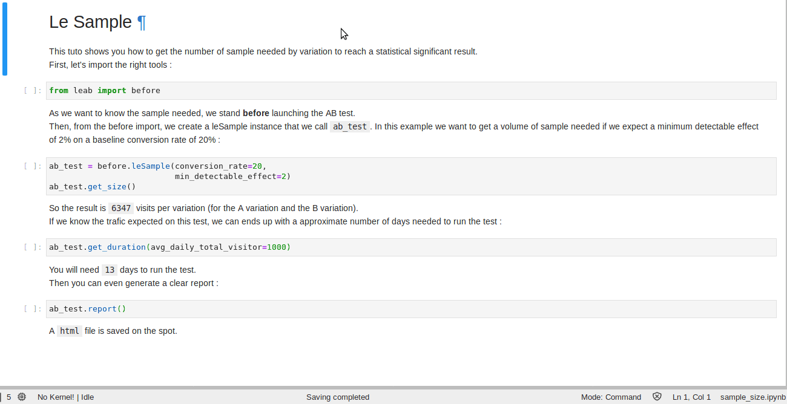

<h1 align="center";
    font-family: Georgia, sans-serif;
    text-decoration: none;
    background: #ffbdfb;
    padding: 3px 6px;
    color: #000;
    font-size: 28px;>
    <a href="#">
    </a>
</h1>
<p align="center">
  <!-- License -->
  <a href="https://opensource.org/licenses/BSD-3-Clause">
    
  </a>
</p>

<p align="center">
  <b>le AB</b> is a Python library for AB testing analysis.
</p>

## ⚡️ Quick start

Before launching your AB test, you can compute the needed **sample size** :

```python
>>> from leab import before

>>> ab_test = before.leSample(conversion_rate=20,
...                           min_detectable_effect=2)
>>> ab_test.get_size()

6347
```

After reaching the needed sample size, you can **compare means** obtained from A VS B :

```python
>>> from leab import after
>>> from leab import leDataset

>>> data = leDataset.SampleLeAverage()

>>> ab_test = after.leAverage(data.A, data.B)
>>> teab_testst.get_verdict()

'Sample A mean is greater'
```

## 🛠 Installation

:snake: You need to install **Python 3.6** or above.

Installation can be done by using `pip`.  
There are [wheels available](https://pypi.org/project/leab/#files) for **Linux**, **MacOS**, and **Windows**.

```bash
pip install leab
```

You can also install the latest development version as so:

```bash
pip install git+https://github.com/tlentali/leab

# Or, through SSH:
pip install git+ssh://git@github.com/tlentali/leab.git
```

## 🥄 Philosophy

> "*Life is a sum of all our choices.*"  
> **Albert Camus**

Get ready to take a decision !

AB testing has never been more popular, especially on Internet based companies.  
Even if each test is unique, some questions seem to be asked again and again :

- when is my test going to be statistically significant ?
- is A more successful than B ?
- does A generate more than B ?

Strong statistical knowledge are required to handle it from start to end correctly.  
To answer those questions in a simple and robust way, we built `le AB`.  
Lets Python do AB testing analysis !  

## 🔥 Features

Here are some benefits of using `Le AB` :

- **Sample size** : How many subjects are needed for my AB test ?
- **Test duration** : How many days are needed for my AB test ?
- **Rate of success** : Does the rate of success differ across two groups ?
- **Average value** : Does the average value differ across two groups ?
- **html auto-report** : Generate a html report for the `sample size` part.

<p align="center">
  <a href="#"></a>
</p>

[Next release](https://github.com/tlentali/leab/projects/1) features :

- **html auto-report** : Generate a html report for the `after` part.
- **sequential sampling** : How many conversions are needed for a sequential AB test ?

## 🔗 Useful links

- [Documentation](https://tlentali.github.io/leab/index.html)
  - [API reference](https://tlentali.github.io/leab/content/api.html)
  - [User guide](https://tlentali.github.io/leab/content/user-guide.html)
- [Issue tracker](https://github.com/tlentali/leab/issues)

## 🎬 Media

- Betclic Data Bi-monthly may 2020 (dispo in may 2020)

## 🙏 Thanks

This project takes its inspiration from [Evan Miller](https://www.evanmiller.org/) great work, especially the following :

- [Sample Size Calculator](https://www.evanmiller.org/ab-testing/sample-size.html)
- [Chi-Squared Test](https://www.evanmiller.org/ab-testing/chi-squared.html)
- [2 Sample T-Test](https://www.evanmiller.org/ab-testing/t-test.html)

Thank you so much Evan M. for your work, it saved our lives so many times !  

A big thanks to [Max Halford](https://maxhalford.github.io/) too, who inspired us in the structure of this project, particularly for docs and tests.  
Have a look at [Creme-ml](https://github.com/creme-ml/creme), it's just amazingly done !

To finish, thanks to all of you who use or are going to use this lib, hope it helps !

## 🖖 Contributing

Feel free to contribute in any way you like, we're always open to new ideas and approaches. If you want to contribute to the code base please check out the [CONTRIBUTING.md](https://github.com/tlentali/leab/blob/master/CONTRIBUTING.md) file. Also take a look at the [issue tracker](https://github.com/tlentali/leab/issues) and see if anything takes your fancy.

This project follows the [all-contributors](https://github.com/all-contributors/all-contributors) specification. Again, contributions of any kind are welcome!

<!-- ALL-CONTRIBUTORS-LIST:START - Do not remove or modify this section -->
<!-- prettier-ignore-start -->
<!-- markdownlint-disable -->
<table>
  <tr>
    <td align="center"><a href="https://github.com/tlentali"><br /><sub><b>tlentali</b></sub></a><br /><a href="https://github.com/tlentali/leab/projects/1" title="Project Management">📆</a> <a href="https://github.com/tlentali/leab/commits?author=tlentali" title="Code">💻</a></td>
    <td align="center"><a href="https://github.com/JLouedec"><br /><sub><b>JLouedec</b></sub></a><br /><a href="https://github.com/tlentali/leab/commits?author=JLouedec" title="Docs">📝</a></td>
    <td align="center"><a href="https://github.com/RomainSa"><br /><sub><b>RomainSa</b></sub></a><br /><a href="https://github.com/tlentali/leab/commits?author=RomainSa" title="Docs">📝</a></td>
  </tr>
</table>
<!-- markdownlint-enable -->
<!-- prettier-ignore-end -->
<!-- ALL-CONTRIBUTORS-LIST:END -->

## 📜 License

```le AB``` is free and open-source software licensed under the [3-clause BSD license](https://github.com/tlentali/leab/blob/master/LICENSE).
